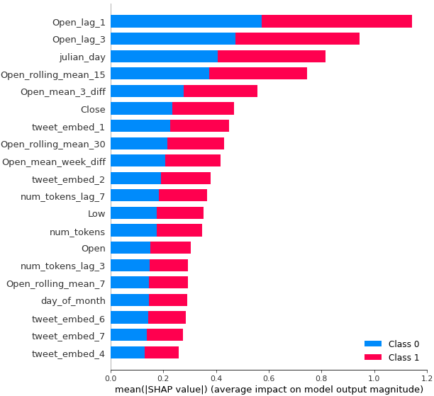

# Data Science Challenge - CaixaBack Tech Hackathon

El CaixaBank Tech Hackathon es una competición de programación organizada por CaixaBank Tech y que cuenta con el apoyo de Nuwe. 
Este evento fue realizado el sabado 28 de Mayo de 2022 a traves de la plataforma [Nuwe](https://nuwe.io/event/caixabank-tech-hackathon), donde 
he participado como uno de los participantes del reto de Data Science.

Objetivo
========

El objetivo del reto se trataba de desarrollar un modelo de predicción binario que permita predecir la variable de salida (target) de si el precio de cierre del IBEX35 en 3 dias seria superior o inferior al precio de cierre actual.

Los datos de entrada dados para el reto son datos historicos de apertura, cierre, maximo y bajo del IBEX35 en un periodo de 25 años de 1994 a 2019.


Tambien hemos recibido un conjunto de datos que continene alrededor de 9800 tweets publicos hechos con el hashtag #IBEX35 que han recibido más de dos likes y de dos retweets desde 2015.

|  |
|:---:|
||
|Wordcloud de tweets con el #Ibex35 |

Metodología
==========

He utilizado una metodología de Machine Learning usando modelos basados en arboles (gradient boosting) para predecir la variable de salida. Este tipo de modelos suele funcionar bien con datos tabulares que asumen que cada observacion es independiente de las demas. Para modelar la temporalidad de los datos, lo usual es valerse de realizar transformaciones que representen informacion de una variable en una ventana de tiempo (como lag, rolling) para que estos modelos puedan aprender esta temporalidad.

|  |
|:---:|
||
|Valores de importancia (shap) de un modelo entrenado usando las variables obtenidas con  feature engineering |

Como mi principal interes estaba en modelar usando procesado de lenguaje natural, he decidido entrenar solo usando la serie de datos de entrada desde 2015 hasta 2019 (para así incorporar los datos de tweets en cada día). La meta era obtener una serie de features que contengan informacion relevante del texto de cada tweet y que el modelo aprenda la relacion entre el precio de cierre del IBEX35 y esto.


El texto de los tweets han sido agrupados por día y posteriormente procesados haciendo uso de una libreria de python llamada [Spacy](https://www.google.com/search?client=safari&rls=en&q=spacy&ie=UTF-8&oe=UTF-8). Primero los he preprocesado eliminando stopwords y lematizando para dejar solo palabras relevantes y luego he obtenido los *[word embeddings](https://en.wikipedia.org/wiki/Word_embedding)* de los tweets de cada día para luego crear una matriz de n x m donde n es el numero de días del conjunto dado y m es el numero de dimensiones de los word embeddings.

Como el numero de dimensiones de los word embeddings dado por Spacy es alto (300 features), y el numero de datos es bastante limitado (~1200 observaciones) he decidido reducir la dimensionalidad por medio de Principal Component Analysis (PCA) donde me he quedado solo con los primeros 10 componentes.

Finalmente, tambien he decidido añadir dos variables indicando el numero de tweets y el numero de tokens (palabras) que se han tweeteado con el hashtag #Ibex35 en cada día y creado variables lag a cada una de ellas de los ultimos 3 y 7 dias anteriores con el proposito de capturar informacion acerca de eventos donde el IBEX35 se encuentre en tendencia (por cualquier razon).


Resultados
==========

Mi entrega final ha sido conseguida con un modelo  `lightgbm` (gradient boosting machine) con todas las variables que he contruido por medio de los metodos mencionados arriba. Los datos de entrada para el modelo tienen una dimensionalidad de 36 variables cuando se incluyen tanto las variables temporales obtenidas a partir de la serie temporal, como las variables que representen la informacion de los tweets (word embeddings y numero de tweets y tokens).

A continuacion presento una tabla con los resultados conseguidos despues de evaluar cada metodo de entrenamiento en un conjunto de evaluacion que consiste en los ultimos 200 dias de la serie temporal desde 2015 hasta 2019 (lo demas fue usado para entrenar cada modelo). 

| Metodo | F1 en conjunto de test (ultimos 200 dias de datos) |
|:---:|:---:|
| `lightgbm` sin feature engineering (dejando los datos como vienen dados)  | 0.52 |
| `lightgbm` con feature engineering (variables temporales + `lag` y `rolling`) | 0.535 |
| `lightgbm` con word embeddings + numerto de tweets y numero de palabras | 0.542 |
| `lightgbm` con feature engineering + word embeddings | 0.584 |
| `lightgbm` con feature engineering + word embeddings + variables basadas en numero de tweets y tokens por día  | 0.63 |


|  |
|:---:|
||
|Valores shap de la prediccion de entrega |

Reproducibilidad
===============

Este repositorio incluye un archivo (`caixahack.env.yaml`) para reproducir el mismo ambiente de `conda` que he usado para entrenar los modelos (Python version 3.9). Para reproducir mis resultados, solo clona el repositorio y ejecuta el siguiente comando para activar el ambiente e instalar las dependencias:

```
conda env create --name caixahack -f caixahack.env.yaml
conda activate caixahack
```

Despues de esto solo dirigete a el notebook `main.ipynb` que contienen los datos de entrada, los modelos y la entrega final y ejecuta cada celda una a una para ver los resultados.


